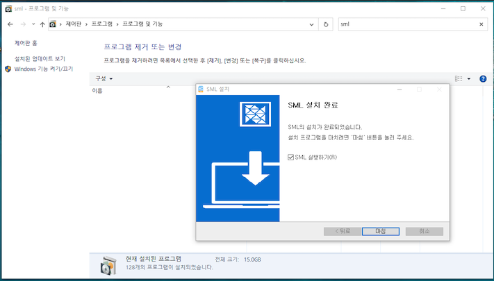
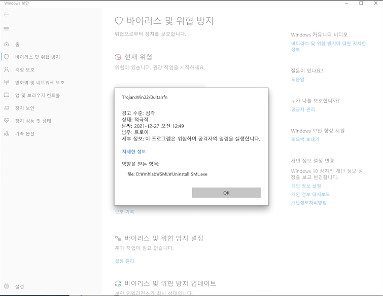
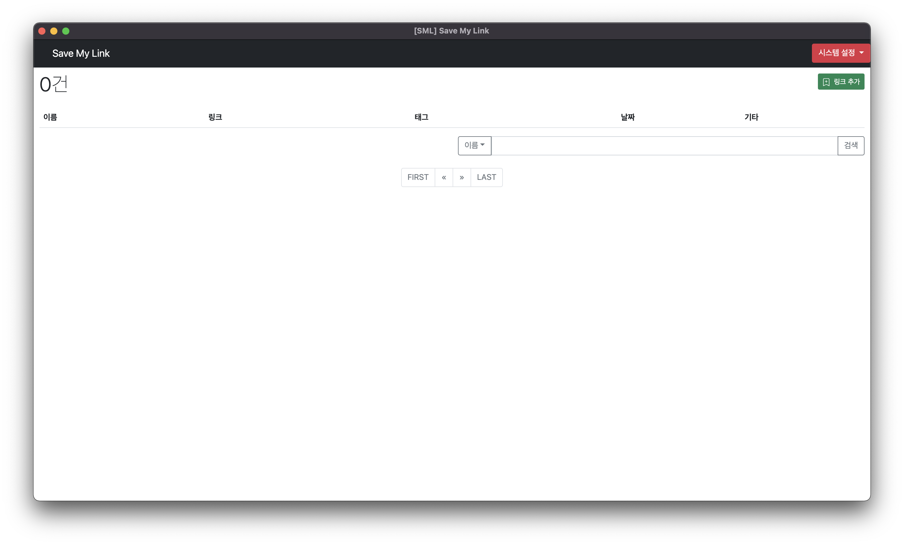
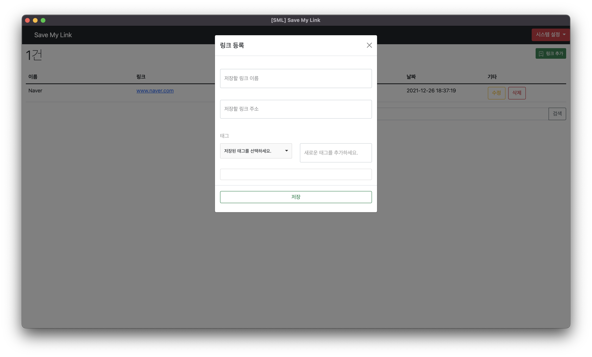
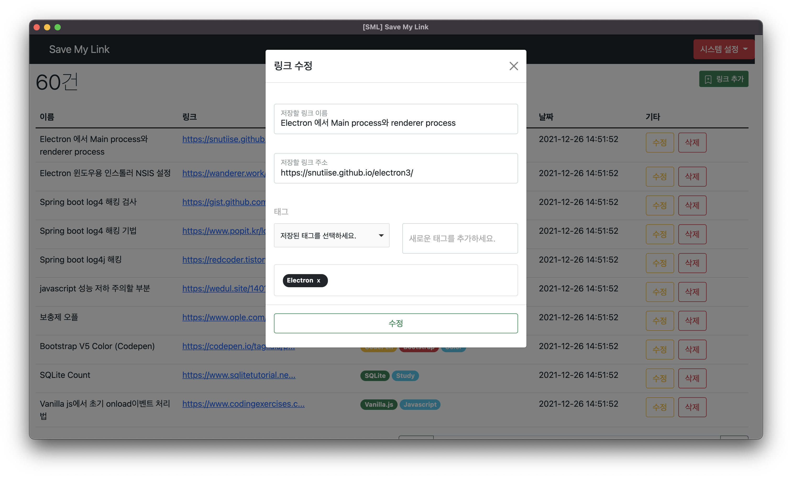

# SML (Save My Link)  

 
 

 
 

 
 

> 개인용 저장 링크 프로그램

 

## What is SML?

 

> 즐겨찾기 관리 프로그램?

 

개발이나 특정 자료를 인터넷에서 찾다보면 다양한 사이트를 방문하면서 해당 사이트를 브라우저에 탭으로 두거나 즐겨찾기 해두는데 시간이 조금만 지나면 관리하기 어려워진다.

그래서 **이것을 해결**하기 위해 만들게 되었다.

**일렉트론(Electron)** 으로 만들어졌으며 Mac에서 개발 및 테스트를 진행하였고, 윈도우 환경은 제한된 환경에서 테스트 진행을 하였다.

제공하는 기능은 다음과 같으며 기능 설명에서 좀 더 자세하게 다룬다.

 

* 링크 데이터
  * 저장 및 수정 삭제 기능 제공
  * 태그(일종의 소규모 카테고리) 기능 제공
  * 페이지와 검색 기능 제공
* 백업 기능
  * 백업은 현재 데이터를 JSON 형태의 파일로 제공한다.
* 복원
  * 백업에서 생성된 JSON 파일을 기반으로 데이터를 복원한다.
  * 현재 SML에 데이터가 없을 때 복원이 가능하다.
* 초기화
  * 현재 저장된 모든 데이터를 초기화한다.

 

--- 

  

## How to install?

* [Release 페이지](https://github.com/elfinlas/SML/releases) 공개된 각 OS에 맞는 버전을 받아서 설치한다.

### Mac

dmg 받아서 설치하면 된다.  
백업 시 Json 파일의 경우 자신의 Home 디렉토리 아래의 SML 디렉토리에 저장한다.  
Mac의 경우 특이한 사항은 없다.

### Window

윈도우의 경우 테스트 할 환경이 없어서 지인의 PC를 통해서 테스트 하였다.  
exe를 실행하면 설치를 하는데 기본 경로는 **c:\program files/sml** 로 잡혀있다.  
이를 먼저 변경해야 한다.  
아무래도 권한 때문에 문제가 발생하는 것으로 예상된다.  
(필자는 윈도우 시스템을 개발해본 경험이 없고, 윈도우 시스템 자체를 안써서 이런 부분에 대한 지식이 부족하다.)  
필자의 경우 다른 파일 경로(d:\sml) 로 잡고 설치를 진행하였다.  
그리고 설치하면 아래의 사진이 뜨면 설치가 완료된 것이다.  

 

그런데 이렇게 설치하면 아래와 같이 윈도우 디팬더의 트로이잔 검출이 뜬다.  

 

이는 왜 그런지 모르겠다.  
그냥 일렉트론 빌드로 설치파일을 만들었는데 계속 저런 메세지가 뜬다.  
찾아보니 의심되는 내용은 다음과 같다.

> 윈도우 프로그램도 배포시 서명이 필요하다.  
> 이를 서명하지 않고 배포하여 이런 현상이 발생하는 것으로 사료된다.

찝찝하신 분은 곧 소스코드 오픈이 되면 직접 빌드해서 쓰시면 될 것 같다.

 

## 기능

### 메인화면

SML 메인 화면은 다음과 갈으며 주요 기능은 다음과 같다.

* 우측 로고
  * 클릭 시 메인 화면으로 돌아온다.
* 시스템 설정
  * SML의 백업 복원 초기화 및 기타 설정을 확인하는 곳
  * 자세한 항목은 **시스템 설정** 항목을 참고.
* 링크 추가
  * 모달이 뜨며 데이터를 추가한다.
 

---

### 데이터 추가

데이터 추가 모달 화면

* 링크 이름
  * 저장할 링크의 제목
  * 보통 블로그나 해당 페이지의 제목을 입력하면 좋다.
  * 이름으로 검색이 가능하다
  * 공백 입력이 가능하나 추천하지 않는다.
* 링크 주소
  * 저장할 링크 주소를 입력한다.
  * URL 형식에 맞게끔 입력해야 한다.
* 태그
  * 저장할 링크 데이터의 관련 태그를 입력한다.
  * 좌측은 이미 입력한 태그를 선택해서 입력할 수 있으며, 우측은 새로운 태그를 입력해서 넣는다.
  * 중복되지 않는 값을 입력하여 작성할 수 있다.
  * 영문 대소문자 구분하며, 특수문자도 입력이 가능하다.
  * 검색에서 해당 태그(중복 검사 가능)들로 검색 가능하다.

---

### 데이터 수정 

데이터 수정 모달 화면
데이터 추가와 같으며 잘못 입력된 값을 수정하는 기능

---

### 데이터 삭제

해당 데이터를 삭제 처리한다.  
삭제된 데이터는 복구할 수 없다.

---

### 데이터 검색

메인화면에서 이름과 태그로 검색이 가능하다. 
* 이름
  * 이름에 들어간 특정 키워드를 통해 검색한다. 
  * 예를 들어 이름에 "Javascript로 개발하는 페이지" 라는 데이터가 있다면 javascript 라는 이름을 검색하면 해당 데이터가 출력된다.
* 태그
  * 링크 데이터 등록 시 사용된 태그를 기반으로 검색한다.
  * 중복 선택이 가능하며 해당 태그가 포함된 데이터를 모두 출력한다.

---

### 시스템 설정 - 데이터 백업

현재 저장된 데이터를 백업하는 기능  
Json 형태의 파일로 저장되며, 저장 경로는 운영체제마다 다르다.  
백업 완료 후 뜨는 알림에 저장 경로가 표시된다.  

---

### 시스템 설정 - 데이터 복원

저장된 Json을 기반으로 복원하는 기능  
SML에 저장된 데이터가 없을 경우에만 수행  
입력 필드에 Json 파일의 내용을 복사 & 붙여넣기 수행하면 된다.

---

### 시스템 설정 - 데이터 초기화

현재 SML에 저장된 모든 데이터를 초기화 해주는 기능  
가급적 백업 이후 실행하거나, 필요할 경우에만 사용한다.

---

## 기타

* 소스코드 오픈은 조만간 진행할 예정 
* 윈도우 설치 시 트로이잔 뜨는 부분에 대한 조사 및 처리 예정

--- 

## 다음 추가 구현 예정

[] 카테고리 기능 추가
[ ] 일부 코드 정리 및 최적화 내용 추가